# AI Data Analyst System

An end-to-end AI-powered business analytics platform that transforms natural language questions into actionable data insights. Built on a PostgreSQL Data Warehouse, three machine learning models, a FastAPI backend, and a Power BI dashboard.

---

## Table of Contents

- [What It Does](#what-it-does)
- [Architecture](#architecture)
- [Tech Stack](#tech-stack)
- [Dataset](#dataset)
- [Project Structure](#project-structure)
- [Data Warehouse](#data-warehouse)
- [Machine Learning Models](#machine-learning-models)
- [API Endpoints](#api-endpoints)
- [Power BI Dashboard](#power-bi-dashboard)
- [Setup](#setup)
- [Future Improvements](#future-improvements)

---

## What It Does

A user types a question in plain English. The system converts it to SQL, queries the Data Warehouse, runs machine learning models, generates a business explanation using a local LLM, and visualizes everything in Power BI.

**Example question:** "What are the predicted sales for next month?"

The system responds with a 30-day revenue forecast, confidence intervals, and a plain-English business summary — all in seconds.

---

## Architecture

```
Natural Language Question
         |
         v
   FastAPI Backend
         |
    _____|_____
   |           |
Text-to-SQL   ML Models
(Ollama LLM)  (Prophet / XGBoost / K-Means)
   |           |
   v           v
PostgreSQL Data Warehouse
         |
         v
   AI Insight Generator
   (Ollama gemma3:4b)
         |
         v
    Power BI Dashboard
```

---

## Tech Stack

| Layer | Technology |
|---|---|
| Data Warehouse | PostgreSQL 18 |
| ETL Pipeline | Python, Pandas, SQLAlchemy |
| Machine Learning | Prophet, XGBoost, Scikit-learn |
| LLM (local) | Ollama — llama3.2:3b, gemma3:4b |
| Backend API | FastAPI, Uvicorn |
| Visualization | Power BI Desktop |
| Language | Python 3.13 |

---

## Dataset

Brazilian E-Commerce dataset by Olist — 9 CSV files, 100k+ orders, 2016 to 2018.

| Table | Records |
|---|---|
| dim_customers | 99,441 |
| dim_sellers | 3,095 |
| dim_products | 32,951 |
| dim_date | 684 |
| dim_geolocation | 27,912 |
| fact_orders | 113,425 |

Source: [Olist Brazilian E-Commerce — Kaggle](https://www.kaggle.com/datasets/olistbr/brazilian-ecommerce)

---

## Project Structure

```
ai-data-analyst-system/
├── data/
│   ├── raw/                        # Original Olist CSV files
│   └── processed/                  # Model output charts
├── etl/
│   └── load.py                     # ETL pipeline
├── database/
│   └── schema.sql                  # Star schema
├── ml/
│   ├── forecasting/
│   │   └── prophet_model.py
│   ├── clustering/
│   │   └── kmeans_model.py
│   ├── review_prediction/
│   │   └── xgboost_model.py
│   └── models/                     # Saved .pkl files
├── app/
│   ├── main.py
│   ├── database.py
│   ├── text_to_sql.py
│   ├── insight_generator.py
│   └── routes/
│       ├── query.py
│       ├── forecast.py
│       ├── review.py
│       └── segments.py
├── dashboard/
│   ├── Sales_Dashboard.pbix
│   ├── page_1.png
│   ├── page_2.png
│   └── page_3.png
├── .env
└── requirements.txt
```

---

## Data Warehouse

Star schema with one central fact table and five dimension tables.

```
        dim_date
           |
dim_customers ── fact_orders ── dim_products
                     |
               dim_sellers
               dim_geolocation
```

Three analytical views pre-built for Power BI and the LLM:

- `vw_monthly_sales`
- `vw_sales_by_category`
- `vw_sales_by_state`

---

## Machine Learning Models

### Sales Forecasting — Prophet

Predicts daily revenue for the next 30 days using Facebook Prophet with order count as an external regressor and outlier removal for incomplete data at the dataset boundary.

| Metric | Result |
|---|---|
| MAE | R$ 2,638 |
| RMSE | R$ 3,298 |
| MAPE | 8.20% |
| R2 | 0.7797 |

Key findings from the seasonality components:

- Consistent upward revenue trend across the full 2016 to 2018 period
- Monday is the strongest sales day of the week at +15%
- November spikes +80% due to Black Friday
- July is consistently the slowest month at -35%

#### Full History + Next 30 Days Forecast

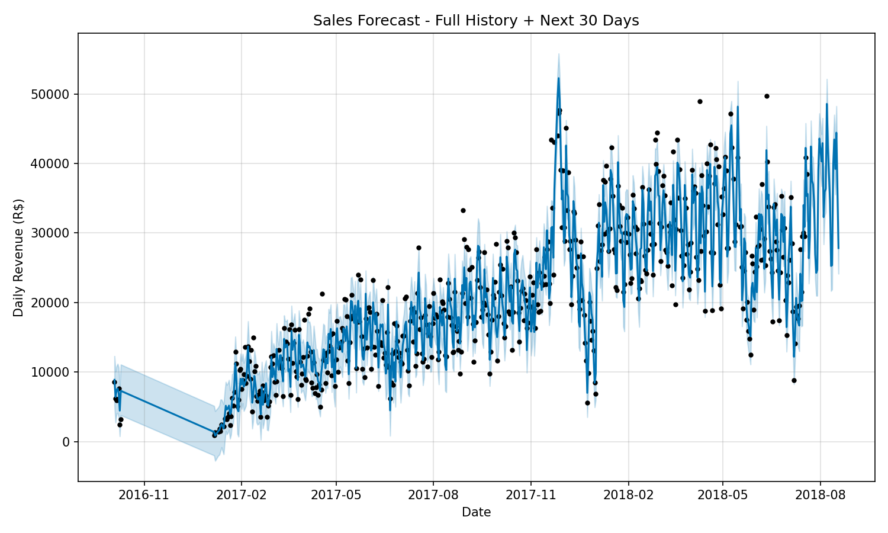

#### Actual vs Predicted — Test Set

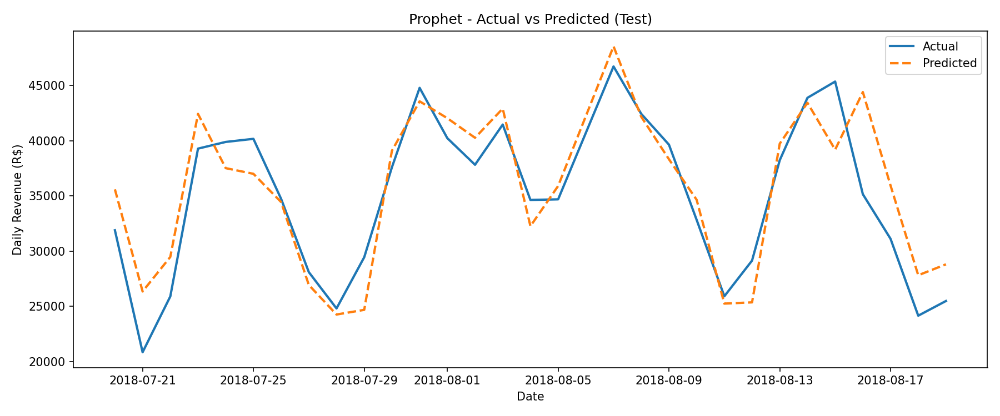

#### Trend, Weekly and Yearly Seasonality Components

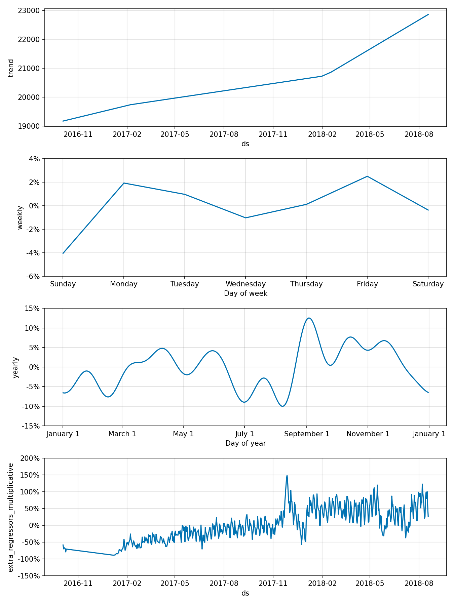

---

### Review Score Prediction — XGBoost

Predicts whether an order will receive a good review (4-5 stars) or bad review (1-3 stars) based on delivery time, price, freight ratio, payment behavior, and seller location.

| Metric | Result |
|---|---|
| Accuracy | 73.75% |
| Precision | 85.55% |
| Recall | 79.25% |
| F1 Score | 82.28% |
| ROC-AUC | 0.7309 |
| Cross-Val F1 Mean (5-fold) | 82.58% |

Training setup:

- 109,362 samples with 80/20 stratified split
- One-hot encoding for all categorical features
- `scale_pos_weight` applied to handle class imbalance (76.9% good vs 23.1% bad)
- `RandomizedSearchCV` with 20 iterations for hyperparameter tuning
- Early stopping with 30 rounds to prevent overfitting

The cross-validation F1 score is stable across all 5 folds confirming the model generalizes well and is not overfitting to the training data.

#### Confusion Matrix

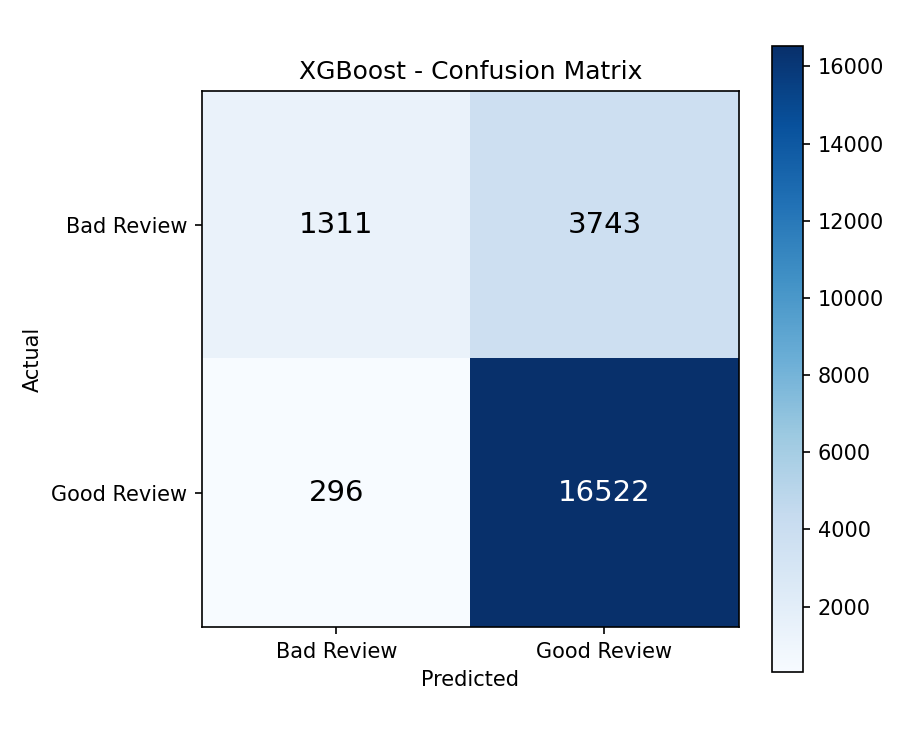

#### Cross Validation F1 Score — 5 Fold

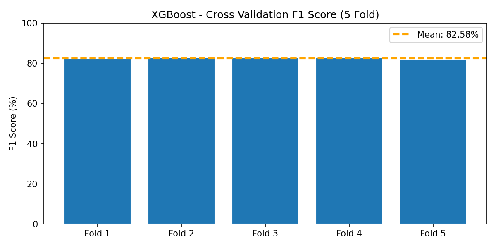

---

### Customer Segmentation — K-Means

Segments 95,824 repeat customers into 4 behavioral groups using 12 features including RFM metrics, delivery experience, freight ratio, and spend patterns. Normalized with StandardScaler before clustering.

| Cluster | Label | Customers | Avg Spend | Avg Review | Avg Delivery |
|---|---|---|---|---|---|
| 0 | Standard Buyers | 66,241 (69.1%) | R$ 79 | 4.58 stars | 9.8 days |
| 1 | Mid-Value Buyers | 15,148 (15.8%) | R$ 303 | 4.26 stars | 10.6 days |
| 2 | Premium Buyers | 1,317 (1.4%) | R$ 1,363 | 4.13 stars | 12.1 days |
| 3 | Frustrated Buyers | 13,118 (13.7%) | R$ 111 | 1.91 stars | 24.8 days |

Final Silhouette Score: 0.2933

K=4 was selected over the mathematically optimal K=2 to produce business-meaningful segments. The key finding is that Cluster 3 customers receive deliveries 2.5x slower than average and rate their experience at 1.91 stars. The root cause is logistics performance, not product quality. Reducing delivery time for this segment is the highest-priority business recommendation.

#### Customer Segments — PCA Projection

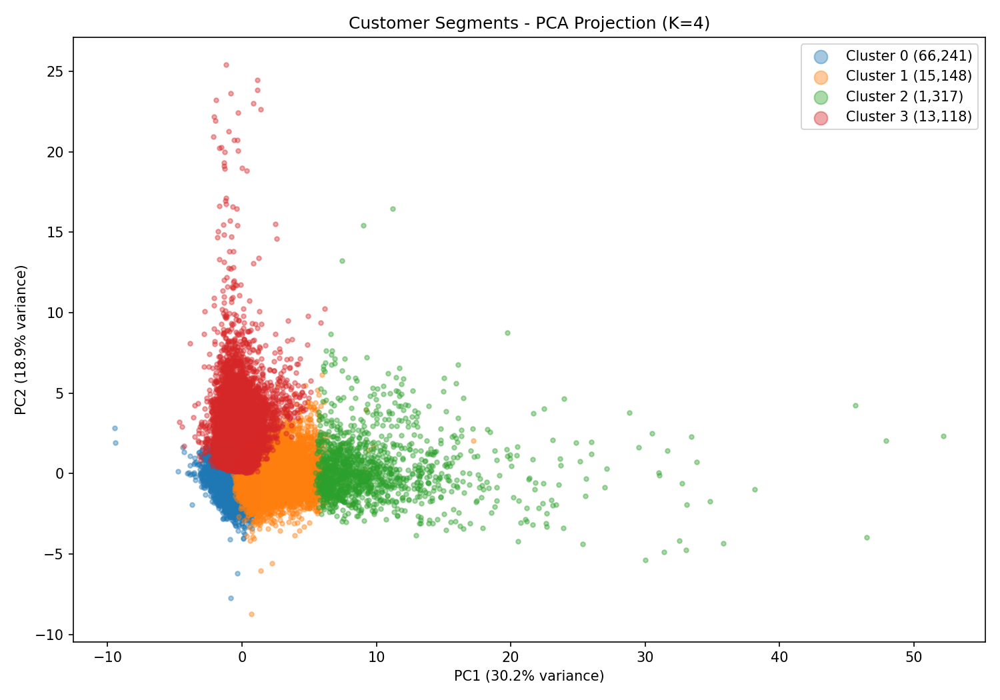

#### Elbow Method and Silhouette Score

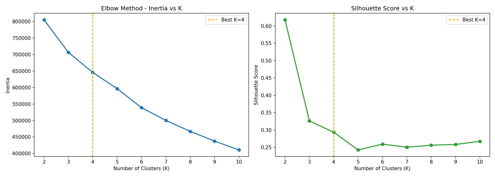

#### Cluster Profiles Heatmap

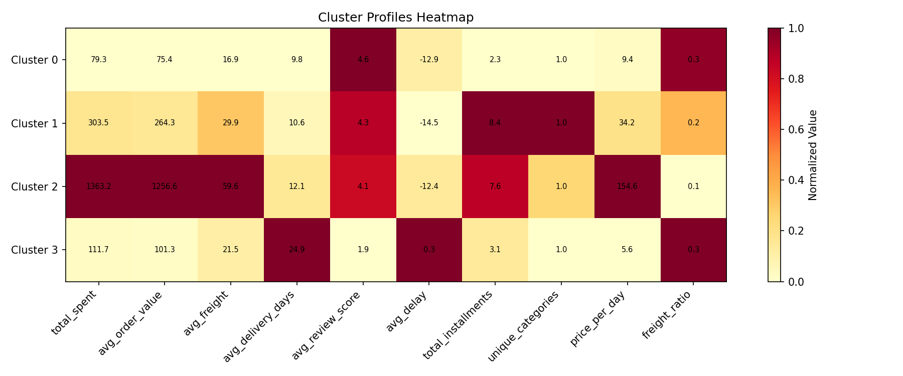

---

## API Endpoints

Start the server:

```bash
uvicorn app.main:app --reload
```

Interactive docs available at: `http://127.0.0.1:8000/docs`

| Method | Endpoint | Description |
|---|---|---|
| GET | / | Health check |
| POST | /query | Natural language to SQL with AI insight |
| GET | /forecast | 30-day Prophet sales forecast |
| POST | /review-predict | Predict good or bad review for an order |
| GET | /segments | K-Means customer segment summary |

Example `/query` request:

```json
{
  "question": "What are the top 5 product categories by total revenue?"
}
```

Example response:

```json
{
  "question": "What are the top 5 product categories by total revenue?",
  "sql": "SELECT category, total_revenue FROM vw_sales_by_category ORDER BY total_revenue DESC LIMIT 5",
  "results": [
    { "category": "health_beauty", "total_revenue": 1258681.34 },
    { "category": "watches_gifts", "total_revenue": 1205005.68 }
  ],
  "insight": "Health and beauty leads all categories at R$1.26M followed closely by watches and gifts at R$1.2M. Revenue is well distributed across the top 5 categories with no single dominant product line.",
  "row_count": 5
}
```

---

## Power BI Dashboard

Four-page report connected to both PostgreSQL and the FastAPI endpoints. The `.pbix` file is included at `dashboard/Sales_Dashboard.pbix`.

### Page 1 — Sales Performance Overview

Revenue trend from 2016 to 2018, KPI cards showing R$13.22M total revenue, 96K orders and 4.01 average review score, geographic distribution across Brazilian states, and top product categories ranked by revenue.

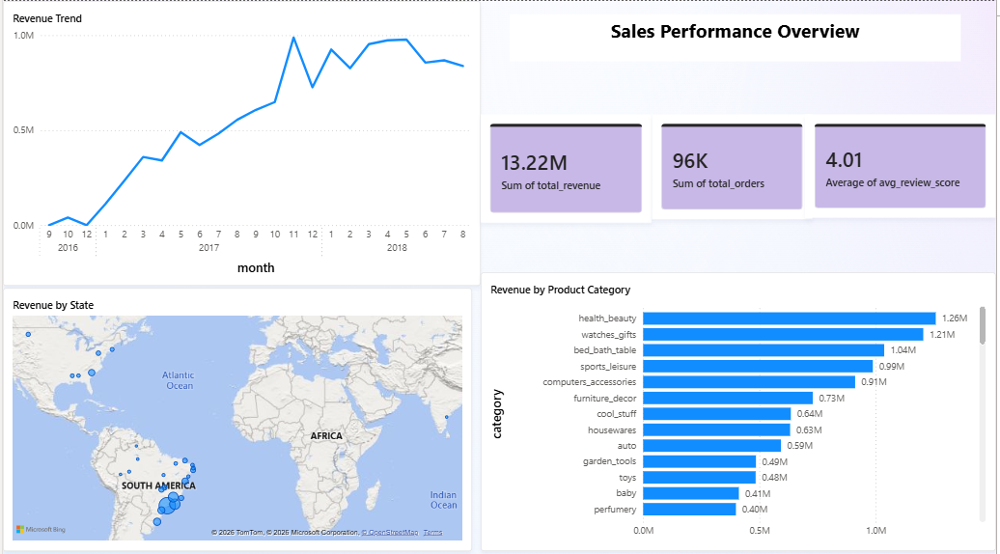

### Page 2 — 30 Day Revenue Forecast

Prophet model predictions showing R$1.09M total forecast revenue over the next 30 days. Peak day identified as Monday August 6 2018 at R$50K. Confidence interval chart showing upper and lower bounds across the forecast window.

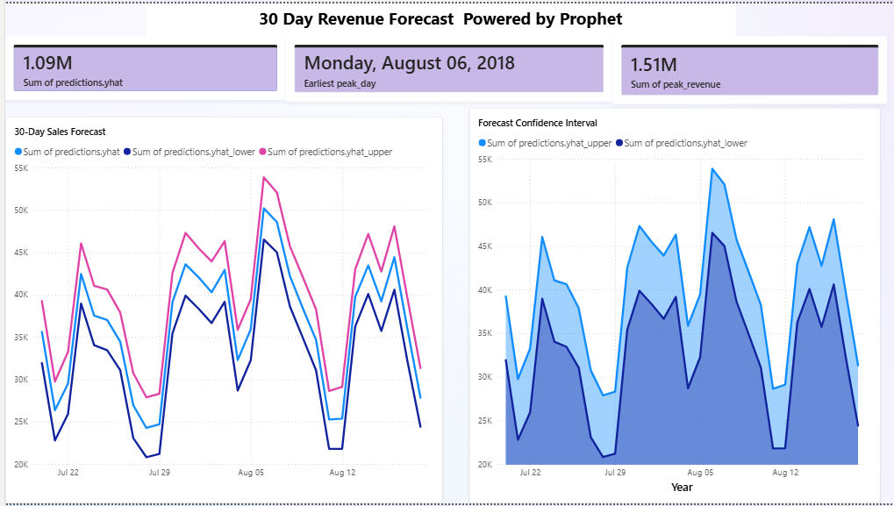

### Page 3 — Customer Segmentation Analysis

K-Means segmentation results showing 4 customer groups. Standard Buyers dominate at 81.8% of the sample. Frustrated Buyers show 2.0 average review score and 21 day average delivery vs 10 days for Standard Buyers — a clear logistics gap driving poor customer satisfaction.

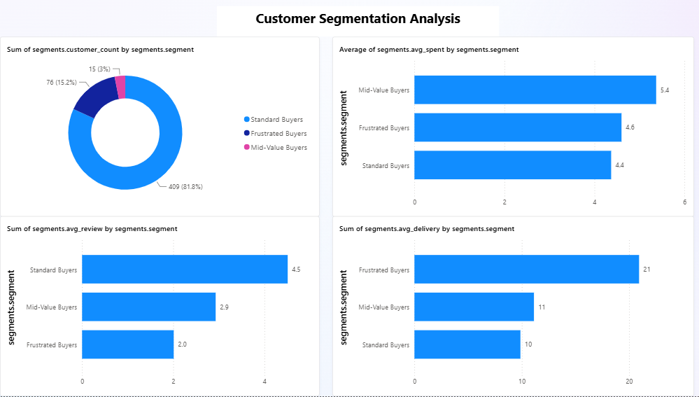

---

## Setup

### Requirements

```
Python 3.13
PostgreSQL 18
Ollama with llama3.2:3b and gemma3:4b pulled
Power BI Desktop
```

### Install dependencies

```bash
pip install pandas sqlalchemy psycopg2-binary python-dotenv prophet xgboost scikit-learn fastapi uvicorn ollama matplotlib seaborn statsmodels
```

### Environment variables

Create a `.env` file in the project root:

```
DB_HOST=localhost
DB_PORT=5432
DB_NAME=ai_analytics
DB_USER=postgres
DB_PASSWORD=your_password
OLLAMA_BASE_URL=http://localhost:11434
OLLAMA_SQL_MODEL=llama3.2:3b
OLLAMA_INSIGHT_MODEL=gemma3:4b
```

### Run the full pipeline

```bash
# 1. Create the schema
psql -U postgres -d ai_analytics -f database/schema.sql

# 2. Load the data
python etl/load.py

# 3. Train the models
python ml/forecasting/prophet_model.py
python ml/review_prediction/xgboost_model.py
python ml/clustering/kmeans_model.py

# 4. Start the API
uvicorn app.main:app --reload
```

---

## Future Improvements

- Add LSTM model as a comparison against Prophet
- Deploy API to cloud using Railway or Render
- Add JWT authentication to FastAPI endpoints
- Connect Power BI to live API for real-time dashboard refresh
- Expand Text-to-SQL to handle multi-table joins automatically
- Add SHAP values to XGBoost for deeper feature explainability

---

